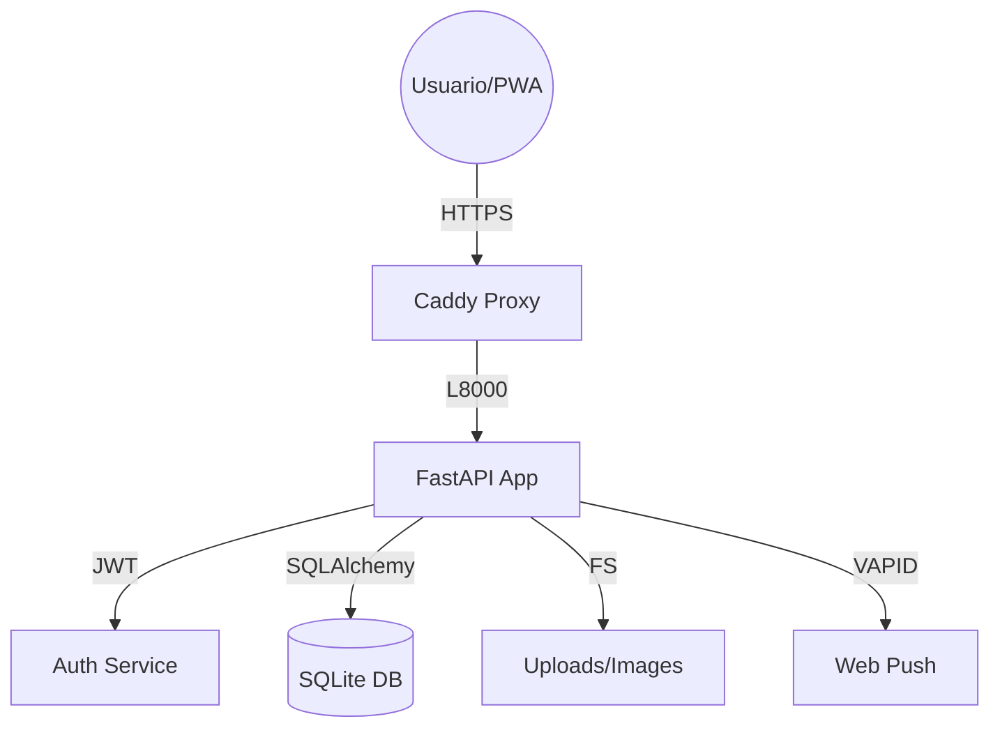

# Convenciones de Desarrollo y Patrones

## Nomenclatura y Estándares
- **Código**: CamelCase para clases, snake_case para funciones y variables.
- **Git**: Commits bajo estándar [Conventional Commits](https://www.conventionalcommits.org/) (feat:, fix:, docs:, refactor:).
- **Idioma**: Comentarios y documentación técnica en **Inglés** (Technical English). Interfaz de usuario en **Español Rioplatense**.

## Backend Architecture (FastAPI)
Siguiendo la **Arquitectura de Capas**:
1.  **Routes (`app/routes/`)**: Definición de endpoints y parseo de inputs.
2.  **Services (`app/services/`)**: Lógica de negocio compleja y orquestación.
3.  **Repositories (`app/repositories/`)**: Consultas SQLAlchemy. **Regla de oro**: Las rutas nunca tocan el objeto Session directamente.
4.  **Models/Schemas**: SQLAlchemy para DB, Pydantic para validación/DTOs.

### Patrones de Código
#### Service Validation
Los métodos de servicio que validan existencia deben terminar en `_with_validation`.
```python
def get_contact_with_validation(db: Session, contact_id: int):
    contact = repository.get_by_id(db, contact_id)
    if not contact:
        raise HTTPException(status_code=404, detail="Contacto no encontrado")
    return contact
```

## Frontend Architecture
- **Tech Stack**: HTML5 + Tailwind CSS (Compiled) + Vanilla JS.
- **PWA**: Offline-first con Service Worker (`sw.js`).
- **Responsive**: Mobile-first grid system.

### API Integration Pattern
Siempre usar el cliente base en `js/api.js` para manejar tokens y errores.
```javascript
async function apiCall(endpoint, options = {}) {
    const token = await getAuthToken(); // From HttpOnly or helper
    // ... logic for headers and fetch
}
```

## Base de Datos (SQLite)
- **WAL Mode**: Activado para permitir lecturas concurrentes.
- **Migraciones**: SQLite no soporta `ALTER COLUMN`. Usar el patrón de tabla temporal para cambios de esquema complejos.

## Guía de Comandos Frecuentes
- **Server**: `uvicorn app.main:app --host 0.0.0.0 --port 8000 --reload`
- **Tests**: `pytest tests/ -v --cov=app`
- **DB Reset**: `rm app.db && python init_db.py`

## Diagrama de Componentes

